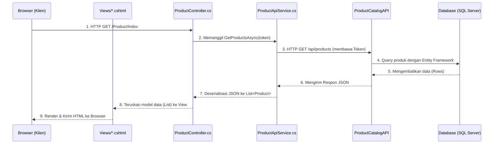

# Alur Permintaan (Request Flow) di Aplikasi MVC

Dokumen ini menjelaskan alur perjalanan (flow) dari saat pengguna (klien) melakukan interaksi di browser sampai data kembali ditampilkan di layar pada arsitektur **ProdukWeb (MVC)** dan **ProductCatalogAPI (REST API)**.

## Contoh Skenario: Menampilkan Daftar Produk (GET /Product)

Berikut adalah urutan file dan komponen yang terlibat ketika user membuka halaman Daftar Produk.

### Penjelasan Langkah demi Langkah

1. **Client / Browser (UI Klien)**
   - Saat pengguna menggunakan browser dan menavigasi ke `https://localhost:xxxx/Product` (atau mengklik tombol di menu interaktif), browser mengirimkan permintaan (`HTTP GET`) ditujukan ke aplikasi web.

2. **Controller (`Controllers/ProductController.cs`)**
   - MVC Router akan menangkap rute `/Product` (atau `/Product/Index`) dan memanggil metode action `Index()` di `ProductController`.
   - Controller juga berfungsi melakukan pengecekan sesi. Ia akan mengambil Token JWT milik user saat ini dari `Session` (termasuk Role dari klaim jika butuh pengecekan hak akses).
   - Controller bersiap untuk mengambil data dan memanggil _Service Layer_ (`ProductApiService`).

3. **Service Layer (`Services/ProductApiService.cs`)**
   - Class ini (bertindak sebagai proxy klain API) akan menangani semua urusan komunikasi HTTP ke Backend (REST API).
   - Di dalam method `GetProductsAsync`, class ini mengatur Header `Authorization: Bearer <token>`.
   - Ia kemudian mengeksekusi request HTTP ke URL API (contoh: `https://localhost:5001/api/products`).

4. **REST API Endpoint (`ProductCatalogAPI`)**
   - Di sisi backend mandiri, `ProductsController` (API) menerima request tersebut, memverifikasi kembali token JWT-nya (Authentication middleware bersertifikat).
   - Setelah tervalidasi, backend melakukan Fetch (mengambil) data List Produk dari Database menggunakan Entity Framework Core (`AppDbContext`).
   - Data list ini akan di-serialize menjadi format standard API, yaitu **JSON**, lalu dikirimkan kembali ke pemanggil sebagai sebuah "Response".

5. **Aplikasi Web Menerima Response**
   - `ProductApiService.cs` di aplikasi MVC menerima response teks JSON tersebut.
   - Kemudian dia mengubah / konversi (Deserialisasi) JSON string itu kembali menjadi tipe data C# yaitu **`List<Product>`**.
   - Objek list inilah yang kemudian "dipulangkan" ke pemanggil awal yaitu `ProductController`.

6. **View Rendering (`Views/Product/Index.cshtml`)**
   - `ProductController` kini punya list dari produk, dia kemudian *melemparkannya* (passing Model) ke user interface dengan mengeksekusi: `return View(products);`
   - Engine Razor mem-parsing seluruh dokumen `Index.cshtml`. 
   - Engine juga menjalankan perulangan `@foreach` ke setiap produk di dalam list data untuk memproduksi baris dan kolom tabel secara dinamis menjadi HTML utuh (mengisi nama produk, harga, stok, serta kondisi if-else untuk status stok). 

7. **Client / Browser (Selesai)**
   - Seluruh tag Razor (`@...`) sudah bertransformasi menjadi HTML biasa tanpa sedikitpun sisa kode C#.
   - File HTML murni ini dikirimkan kembali lewat internet kepada browser klien. HTML tersebut ditampilkan kepada user dengan styling Bootstrap/CSS yang rapi.

---

### Alur Singkat: Action Form / Penyimpanan (POST Flow)

Jika interaksinya bukan Request GET biasa melainkan **Aksi Submit Form Data** (seperti tambah produk / simpan form / Delete Form):

- **Klien**: Mengisi form di halaman (View: `Create.cshtml` atau Modal UI) dan meng-klik "Submit".
- **Controller**: Endpoint POST (`[HttpPost] Create(...)`) pada `Controllers/ProductController.cs` di triggered.
- **Validasi**: Controller memvalidasi input sederhana (ModelState.IsValid).
- **Service**: Controller memanggil Service. Service mengirim data form melalui HTTP POST dengan Body berupa (JSON).
- **API Backend**: API Menerima, validasi logika modelnya, lalu Insert record ke Database dan mengirim pesan ke MVC (Status 201 Created atau Status 200 OK).
- **Controller**: Memproses pesan sukses dari API, lalu melakukan perintah `RedirectToAction("Index")` (meminta browser menuju ke Request GET Daftar Produk).
- **Klien**: Browser berganti URL dan data produk baru tampil di tabel list view.
